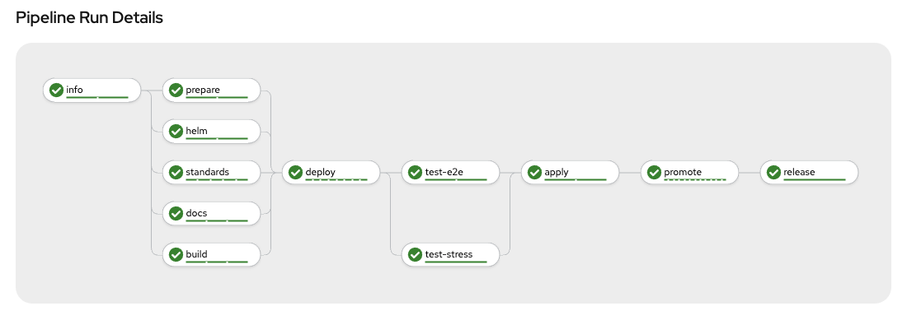

This is an example of a pipeline developed in Tekton, the peaceful cat. It contains the main steps of a continuous software delivery process. It enforces a strict semantic version validation strategy, managing tag increments for you. Develop, Features, releases, patches and hotfixes flows are supported.


There are several task templates available online. However, one of the biggest benefits of this repository is being able to take advantage of a model that holds all tasks in a solid and coherent way and with good parameters to be reused.



## Design considerations

Seeking to minimize dependencies on other components and avoid building your own images, bash scripting is primarily used and provides a solid and easy model to be extended.

The different number of images being used has been taken into account. And with security in mind, only official images are consumed.

This package automatically manages the creation of three environments, which can be customized as needed. The 3 different environments are, `cicd`, `development`, and `production`. All the components corresponding to each environment were carefully introduced and are following the least privilege principle.

## Github Integration

The integration with the Github repository is done through a token to manage integrations and with a secure password-less RSA key-pair to add new commits and tags. You will need to provide a valid, compatible, private key that is available to your Github account.

Besides that, it was designed to be plug and play. Upon installation, the webhook will be created automatically for you and all other data must come from the payload received through a new commit in your repository.

It also allows changing the status of each commit to pending or success depending on the result of the pipeline tasks. Developers can view the status of each commit in the github interface.


## Deployments

The pipeline manages the creation of deployments for each environment and also takes care of enforcing standards such as code linting, chart linting, unit testing, code audit, and code coverage.

Images streams, services, and routes are created automatically through the pipeline, if necessary, at each new commit. This provides a repeatable way for software delivery and makes life easier for users who consume the application, whether for development or for other purposes.

Access routes are defined following the model below, giving environments as `development` and `production`.


| Branch name | URL |
| --- | --- |
| `release/1.0.0` | v1-0-0-production.apps.s45.core.rht-labs.com |
| `hotfix/1.0.1` | v1-0-1-production.apps.s45.core.rht-labs.com |
| `patch/1.0.2` | v1-0-2-production.apps.s45.core.rht-labs.com |
| `develop` | develop-development.apps.s45.core.rht-labs.com |
| `feature/login-page` | feature-login-page-development.apps.s45.core.rht-labs.com |

## Installing

In this step by step we will assume the following values:

| Namespace | Value |
| --- | --- |
| CI-CD | labs-ci-cd |
| Development | do101-development |
| Production | do101-production |

If a ci-cd environment already exists, you can use it without the need to create a different one.

For the other two environments you have to ensure that they exist. If they do not exist, you can create following the example below;

    oc create namespace labs-ci-cd
    oc create namespace do101-development
    oc create namespace do101-production

### Configuration

To configure your own application and send it through the pipeline you must update the `values.yaml` file to reflect a repository to which you have access. Please use a repository with a lowercase name.

It will be in this repository that the webhook will be automatically created and will trigger, on each new commit, a new PipelineRun on Tekton. You can create a new token on Github by [clicking here](https://github.com/settings/tokens), make sure to tick the `admin:repo_hook`, `repo` and `user`.

#### Secrets 

The Github token will only be shown once, be sure to save it somewhere safe. 
Then copy the token and replace it in the command below.

    oc create secret generic github-webhook-secret --from-literal=token=XXXXXXXXXXXXXXXX -n labs-ci-cd

In order to avoid using passwords to publish new content on Github, we will use a keypair. [Here's](https://docs.github.com/en/free-pro-team@latest/github/authenticating-to-github/generating-a-new-ssh-key-and-adding-it-to-the-ssh-agent) how to create one if you don't already have one available on your machine.

Assuming your private key was created in the default location `$HOME/.ssh/id_rsa`, you can run the command below to create a generic secret.

    oc create secret generic github-deploy-secret \
        --from-file=ssh-privatekey=$HOME/.ssh/id_rsa \
        --namespace labs-ci-cd

#### Applying

Great. Now that the secrets have been set up correctly we can install the package. For this, we will use helm, as below.

    helm template -f charts/tekton-demo/values.yaml charts/tekton-demo | oc apply -f-

How to verify that the installation was successful:

1. See if you github webhook integration was created. Go to your github repository, click on Settings, and then on Webhooks.
2. 

### Policies

Before publishing a new commit, we will need to define some permissions for the pipeline ServiceAccount. This will allow the pipeline to move images from one environment to another.

```
oc policy add-role-to-user \
    system:image-puller system:serviceaccount:labs-ci-cd:tekton-triggers-sa \
    --namespace=do101-development
```

```
oc policy add-role-to-user \
    system:image-puller system:serviceaccount:labs-ci-cd:tekton-triggers-sa \
    --namespace=do101-production
```

And also for triggers ServiceAccount:

    oc adm policy add-scc-to-user privileged system:serviceaccount:labs-ci-cd:tekton-triggers-sa -n labs-ci-cd
    oc adm policy add-scc-to-user privileged system:serviceaccount:labs-ci-cd:tekton-triggers-sa -n do101-development
    oc adm policy add-scc-to-user privileged system:serviceaccount:labs-ci-cd:tekton-triggers-sa -n do101-production
    oc adm policy add-role-to-user edit system:serviceaccount:labs-ci-cd:tekton-triggers-sa -n labs-ci-cd
    oc adm policy add-role-to-user edit system:serviceaccount:labs-ci-cd:tekton-triggers-sa -n do101-development
    oc adm policy add-role-to-user edit system:serviceaccount:labs-ci-cd:tekton-triggers-sa -n do101-production

Something failed? See troubleshooting.

2. Check pod `create-do101-github-webhook-pod-kmc4p` and make sure the webhook was created correctly
2. Define policies
<!-- 

### Deploying to development environment

1. Create a new branch called `develop` and push to the repo to trigger a new build

    git checkout -b develop
    git push origin develop

2. Create a new branch called `feature/awesome-feature` and push to the repo to trigger a new independent build

    git checkout -b feature/awesome-feature
    git push origin feature/awesome-feature

### Deploying to production environment

1. From the latest `develop` branch, create a new branch called `release/1.0.0`

    git checkout -b release/1.0.0
    git push origin release/1.0.0

2. Patching and hotfixes folllows the same structure

    git checkout -b hotfix/1.0.1
    git push origin hotfix/1.0.1

    git checkout -b patch/1.0.2
    git push origin patch/1.0.2 -->